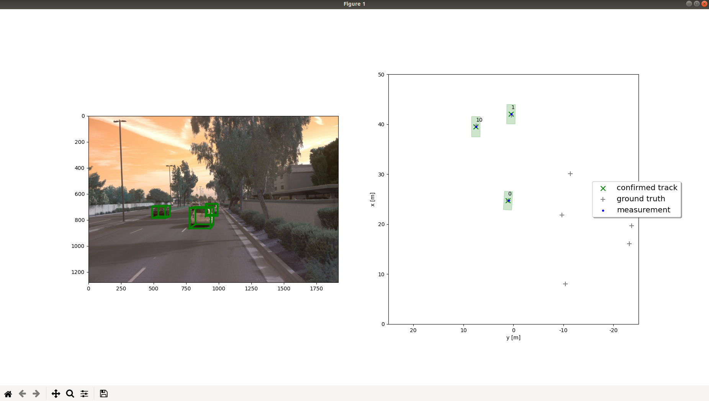
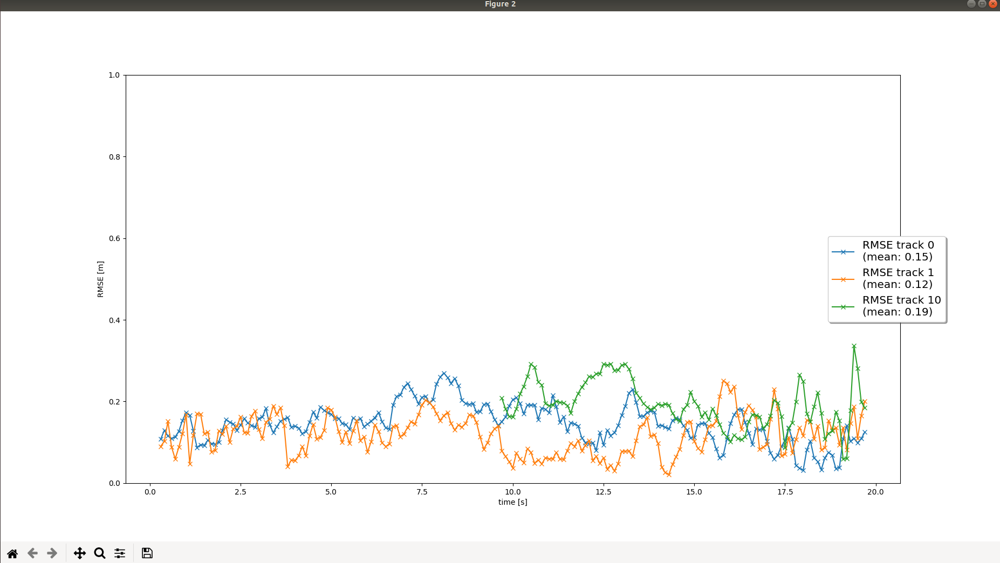

# Writeup: Track 3D-Objects Over Time

In this section, I learned the theory about Kalman Filter and the mothods about sensor fusion and objects tracking.

## Step 1. Implementing an Extended Kalman Filter

Two steps:
  1. Sate x will be predicted and error covariance P will be estimated
  2. Update state x and covariance P

RMSE of lidar tracking:

## Step 2. Implementimg a Track Management

Implementing track management includ track state and track score, track initialization and deletion.

The following steps were taken for this:

- `State Initialization`: Initialize stat x, covariance P.
- Initialize new track with unassigned lidar measurement.
- `Track score`: The corresponding scores will be increased if the scores on the track are correlated with measurement and vice versa.

- `Track state`: Based on the track score, a track state can be defined, for example `initialized`, `tentative` or `confirmed`.
- `Track delete`:
    Tracking will be delet if score is smaller or P is too big.

The following image shows the rmse plot for single tracking.

## Step 3. Data Association

Implementing a single nearest neighbor data association to associate measurements to tracks.

- Initialize association matrix
- `Mahalanobis Distance`:  The nearest track and measurement for association will be calculated by the distance of Mahalanobis Distance.

- `Gating`: Check if a measurement lies inside a tracks gate.

    We will set the distance to infinity if the measurement lies outside a track's gate.

- Update association matrix:

    The pair with the smallest Mahalanobis Distance will be choose to update Kalman Filter, and delete the relation matrix with the appropriate row and column.

## Step 4. Sensor Fusion

Implementing camera-lidar fusion.

- `Visibility`: Checking if the object can be seen by the sensor or not.
- `EKF`: The non-linear transformation of camera measurement will be supported by  Extend Kalman Filter.
  - nonlinear camera measurement function h:
    - transform position estimate from vehicle coordinates system to camera coordinates system
    - project from camera coordinates system to image coordinates coordinates system
  - calculate Jacobian H

Final reslut:

## Difficulties Faced in Project

All codes we needs are almost be mentioned in the class.
But in `trackmengement` part, I have some confuse, as below:

- decress score for unassigned tracka:

    This part was not mentioned in the class, so I spent some time studying and understanding this part.

- track deletion criteria:

    In the class material, it said when covariance was smaller than some threshold then this track would be deleted, but the "Hints" said the track would be deleted when covariance P is too big. So I spent some time studying and understanding this part.

## Benefits in Camera-Lidar Fusion

Comparing the RSME results between "Only Lidar measurement" and "Camera-Lidar Fusion measurement", the  "fusion" results about the position and the size of a 3D bounding box is more accurate than "only lidar" result:

Only Lidar measurement:

Camera-Lidar Fusion:

## Challenges in real-life scenarios

- More sensors means higher cost of the product.
  
- Computing costs will increase in complex environment.
  
- Coordinate Transformation: Each sensor has its own coordinates

## Ways to Improve Tracking Results

- Fine-tune the parameters in `param.py`, such as process noise Q, measurement noise R, initial setting for estimation error covariance P.
- Other Tracking method, such as Unscented Kalman Filter(UKF) or some deeplearning methods.
- Other data association method, such as `Global Nearest Neighbor (GNN)` or `Probabilistic Data Association (PDA)`.
