# Sensor Fusion - 3D-Objects

In this section, I learned how to process lidar point-clouds data from waymo dataset and detect 3D object in lidar by Complex YOLO algorithm.

## Step 1. Converting Range Images to Point Clouds

### 1. Visualizing Range Images

First, the range range images can be visualiized for understanding the dataset.

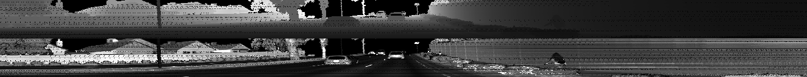

### 2. Converting Range Images to Point Clouds

- The point cloud data can be visualized in Open3D
- Visualize lidar point-cloud

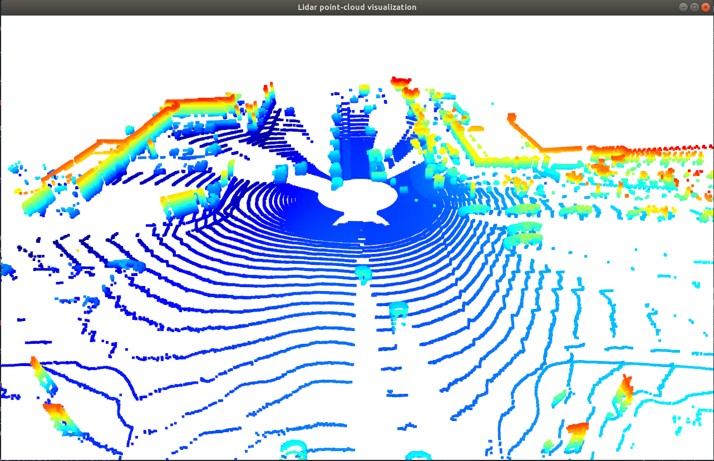

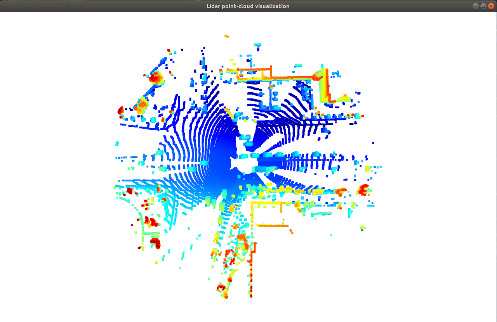

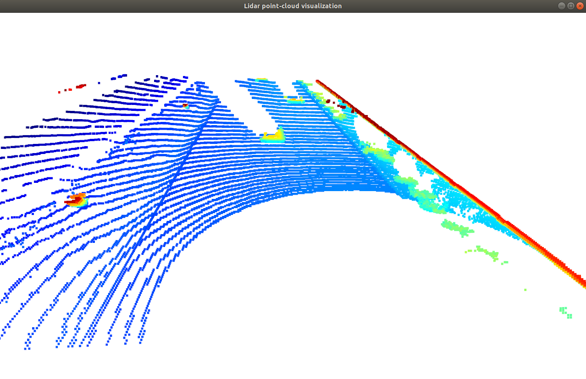

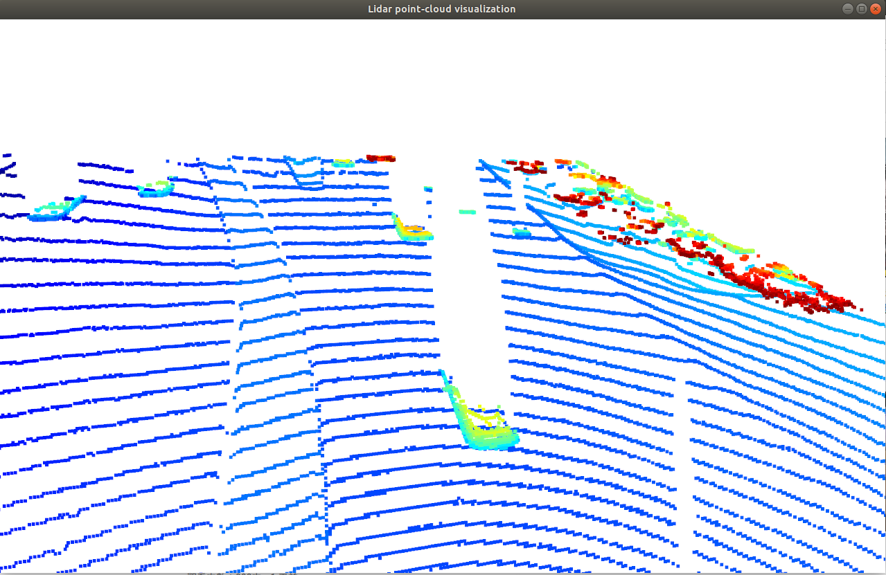

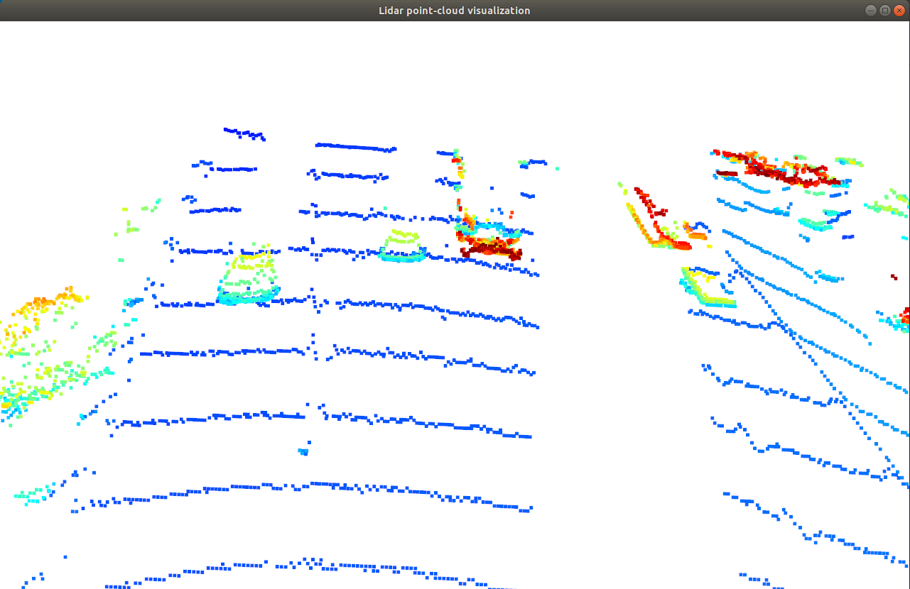

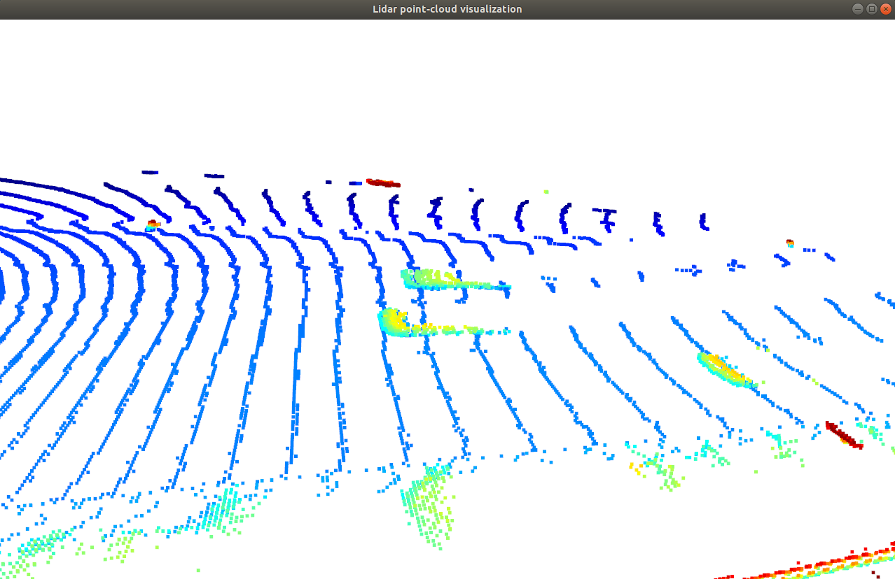

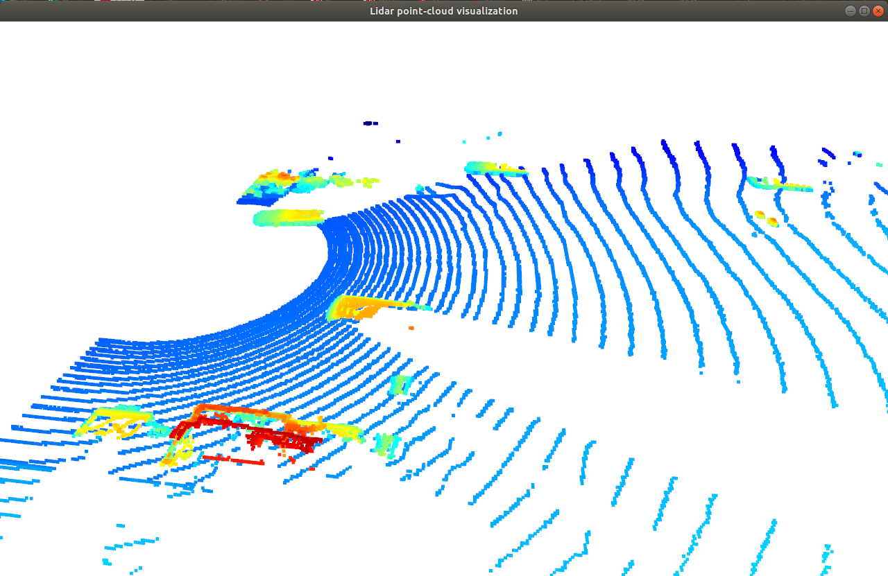

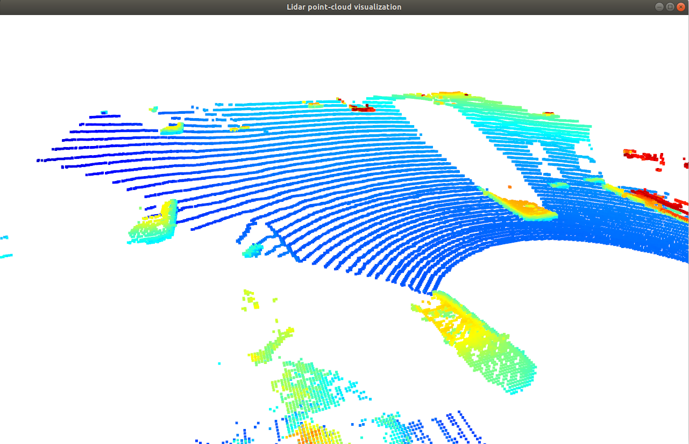

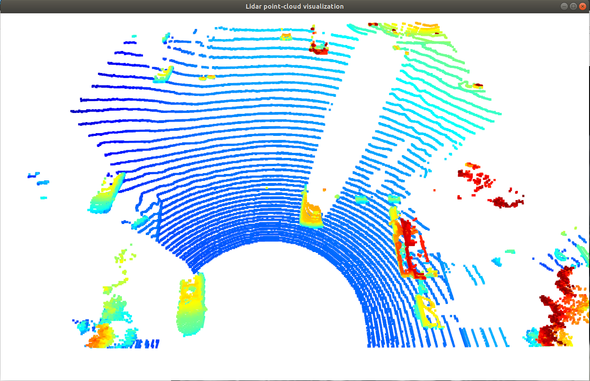

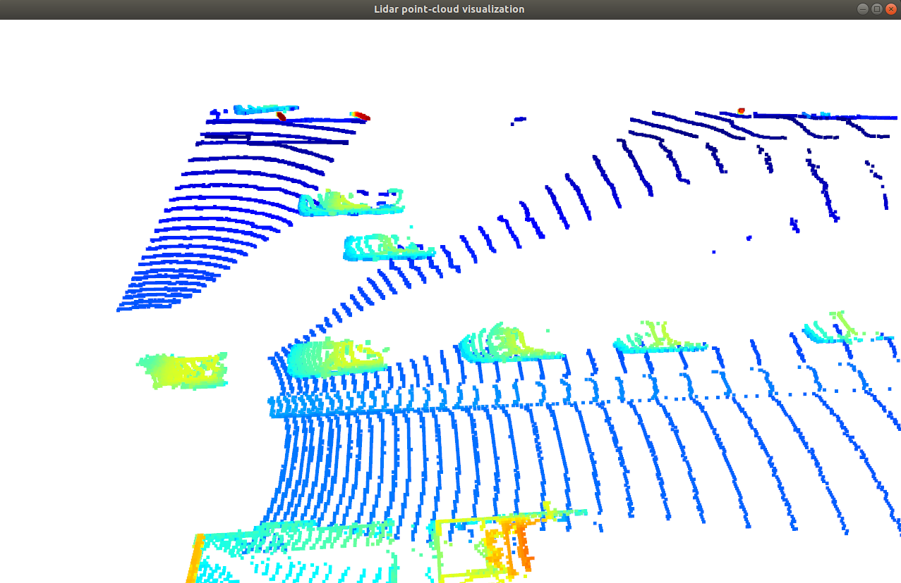


The structure, edge and contour of the object from lidar point cloud data are the main features(rear-bumper, front-bumper, sides of vehicles) for the object detection algorithm. 

## Step 2. Create Birds-Eye View (BEV) from Lidar PCL

### 1. Convert sensor coordinate to BEV-map coordinates

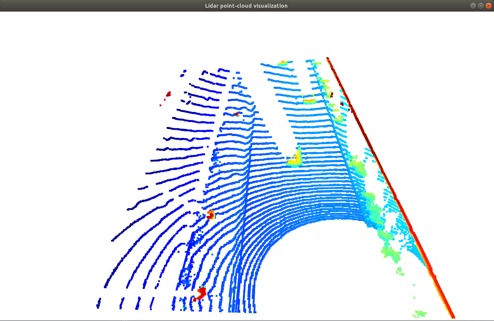


### 2. Compute intensity/hight/density layer of the BEV map

There are three kinds of information can be oberserved for each BEV cell, wihic is `intensity`, `height`, and `density` information.

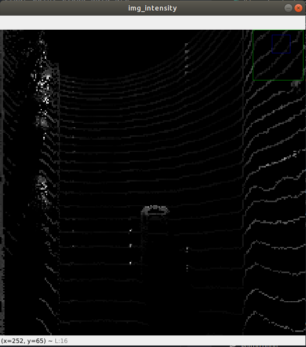

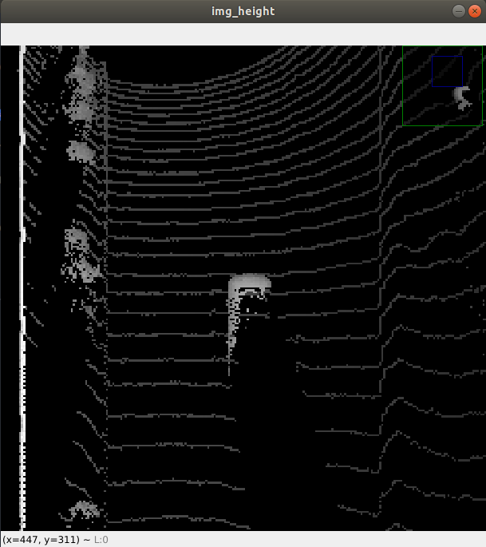

## Step 3. Model-based Object Detection in BEV Image

The BEV-map will be the input data for the model, and the output result is 3d bounding boxes information.

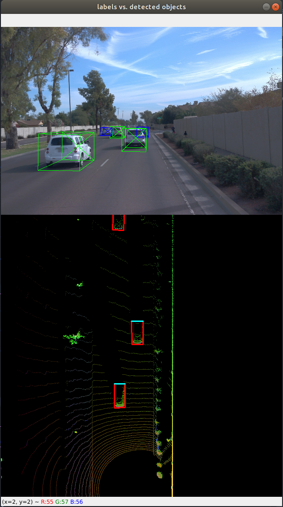


## Step 4. Performance Evaluation for Object Detection

### 1. Compute intersection-over-union (IOU) between labels and detections

### 2. Compute false-negatives and false-positives

### 4. Compote percision and recall

The precision-recall curve is plotted showing similar results of `precision = 0.9506` and `recall = 0.944`.

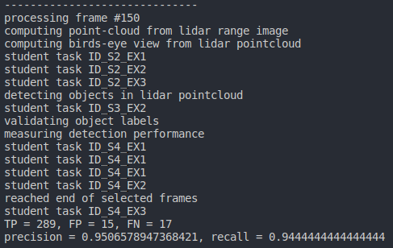

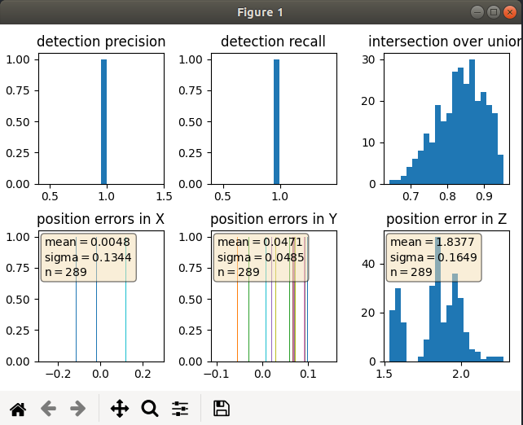

In the next step,  we set:

```python
configs_det.use_labels_as_objects=True
```
The resulting performance measures for this setting should be the following:

which results in `precision = 1.0 and recall = 1.0`, which is shown in the following image:

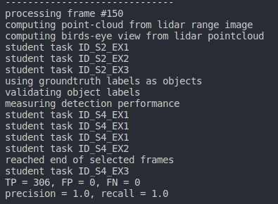

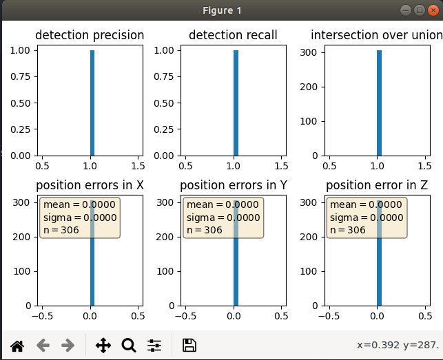
